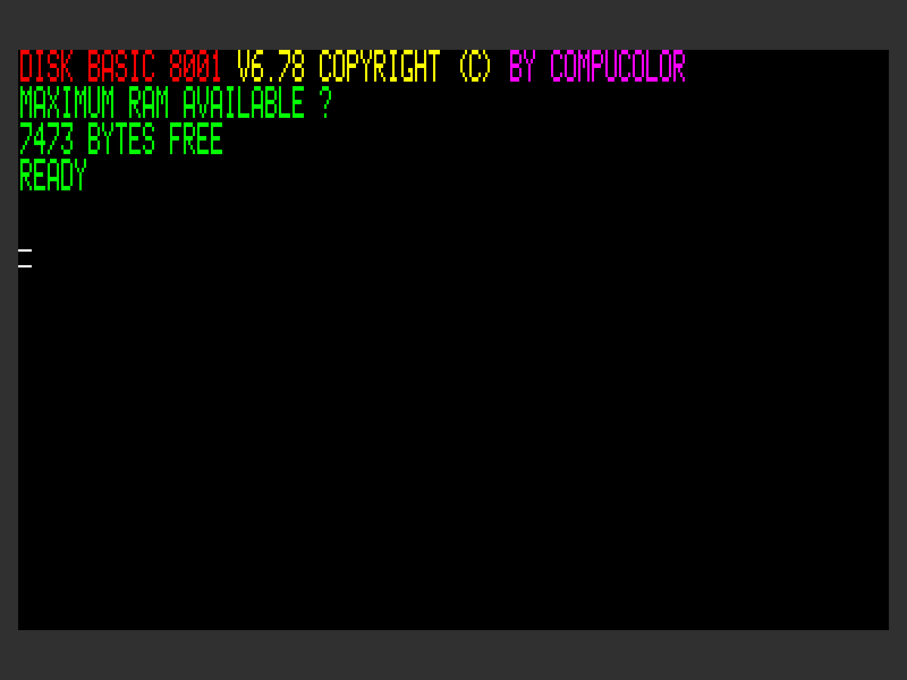

# Compucolor II Home Computer

This is a Clash implementation of the 1977 Compucolor II home computer
manifactured by the CompuColor Corporation until 1980.



## Hardware architecture

* **CPU**: Intel 8080.

* **Video**: SMC CRT 5027 video chip generates a 64⨯32 cell
  screen. Each cell is either a character index into a built-in font
  ROM, or a 2⨯4 bitmap with double-width pixels. Characters can
  optionally be rendered at double height.

  The CPU has two ways of accessing the backing 2K video RAM: slow
  access (preempted by the video system) and fast access (leading to
  video glitches in the meantime).

* **IO**: TMS 5501 IO controller handles interrupt servicing, keyboard
  input, serial IO and disk IO.


## Clash implementation

* **CPU**: Implemented based on abstract descriptions of Intel 8080 ISA,
  with no reference to real implementation. Instructions take the same
  number of cycles as a real Intel 8080, which is needed for the tight
  timing constraints of the floppy drive.

* **Video**: Standard 800⨯600@60Hz VGA, with 40MHz pixel clock.
  Logical "pixels" are scaled 2⨯2. Hardware cursor and vertical
  scrolling is implemented via the CRT 5027.

* **Framebuffer**: Since the video system needs access to both
  even-addressed (character index) and odd-addressed (color etc.)
  bytes, preferably in the same cycle, the framebuffer is split into
  two 1K RAMs, one holding the even and the other holding the odd
  addresses. The CPU reads/writes these through special logic handling
  the least significant bit of the original (single-byte) address.

* **IO**: The TMS 5501 IO controller is implemented fully: timers,
  parallel IO, interrupt servicing and UART are all implemented based
  on the original data sheet. Instead of the fixed clock divisor of
  128 in the real TMS 5501 (designed for a 2 MHz clock), this
  implementation divides into 64 μs regardless of the clock speed.

* **Input**: PS/2 keyboard events are decoded into a virtual key
  matrix, which is connected to the TMS 5501.
  
* **Disk drive**: Virtual "disk" served from a small block ROM,
  connected to the serial port of the TMS 5501.

* **Turbo switch**: If unset, the CPU is slowed down by idling for 19
  out of every 20 cycles. This way, even though it runs at the pixel
  clock speed of 40 MHz, real-time games are still playable. 

# Simulation

Simulations of several abstraction level are included. Most come in
two flavors: using Clash, or using Verilator. The Verilator ones
generally perform much better, but require installing Verilator and
compiling with the `verilator` Cabal flag.

## Limitations

* The CRT 5027 video controller only implements the 64⨯32 character
  mode used by the Compcolor II
  
* The serial data rate of the TMS 5501 is fixed at 9600 bps

* Keyboard input is not implemented in any of the simulations

# Synthesizing

Included are Shake rules to build for various hobbyist FPGA dev
boards:

* The Xilinx Artrix-7 based Nexys A7 50T. This uses the Xilinx Vivado
  toolchain.

* TODO: The Xilinx Spartan-6 based Papilio Pro or the Spartan-3 based
  Papilio One, both with the Arcade mega-wing. These use the Xilinx ISE
  toolchain.

Make a file called `build.mk` with content similar to the following:

```
TARGET = nexys-a7-50t
ISE = ~/prog/docker/xilinx-ubuntu-12.04/run
VIVADO = ~/prog/docker/xilinx-2019.1-ubuntu-18.04/run
DISK = image/disks/hangman.ccvf
```

The `ISE` and `VIVADO` fields are to optionally wrap invocations of
the Xilinx ISE / Vivado toolchain in case you want to run them via
Stack, Docker, Nix, etc.

Then you can build into an FPGA configuration bitfile by running the
included `mk` script.


# Useful links

* [Wikipedia](https://en.wikipedia.org/wiki/Compucolor_II)
* [Oldcomputers.net](http://oldcomputers.net/compucolor-ii.html)
* [Compucolor.org](http://www.compucolor.org/): all things Compucolor
  II, including heaps of original documentation and a software
  emulator written in JavaScript.
* [CRT5027 page at the IntelliWiki](http://wiki.intellivision.us/index.php?title=TMS9927_CRT_Controller)
* [TMS5501 datasheet](https://amaus.net/static/S100/TI/datasheet/Texas%20Instruments%20TMS5501%20Specification%20197608.pdf)
* [Intel 8080 opcodes](http://pastraiser.com/cpu/i8080/i8080_opcodes.html)
* [Intel 8080 opcodes](http://www.classiccmp.org/dunfield/r/8080.txt)
* [Monadic descriptions of CPUs in Clash](https://gergo.erdi.hu/blog/2018-09-30-composable_cpu_descriptions_in_c_ash,_and_wrap-up_of_retrochallenge_2018_09/)
* [Integrating Verilator and Clash](https://gergo.erdi.hu/blog/2020-05-07-integrating_verilator_and_clash_via_cabal/)
* [Nexys A7 FPGA dev board](https://reference.digilentinc.com/reference/programmable-logic/nexys-a7/start)
* [Papilio Pro FPGA dev board](https://papilio.cc/index.php?n=Papilio.PapilioPro)
